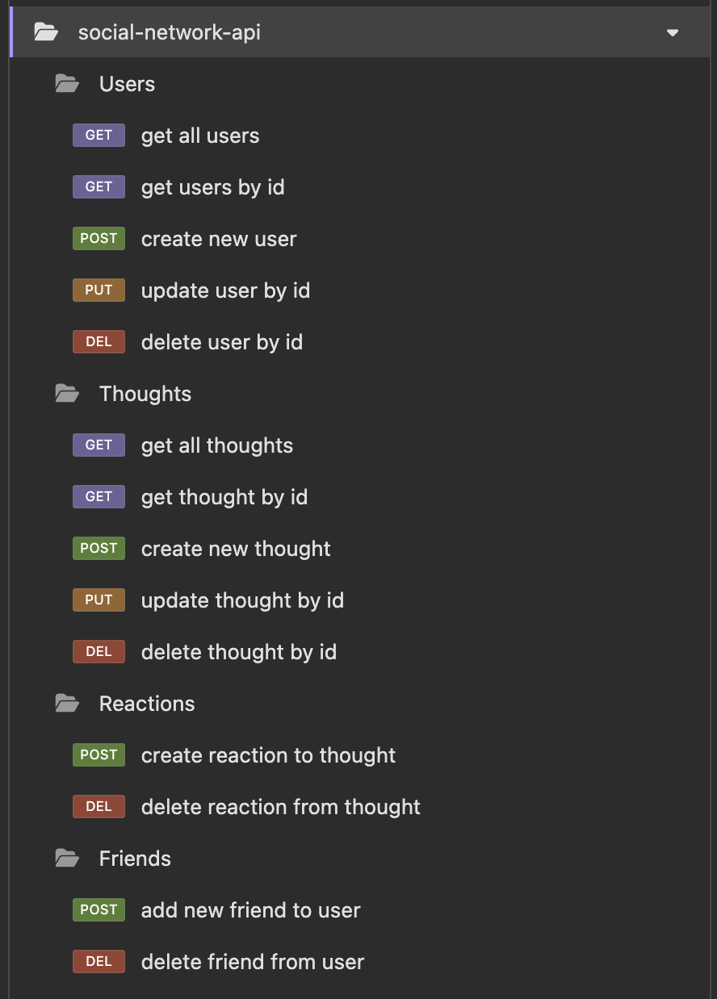

# Social Network API

## Description

The Social Network API is a backend solution designed for a social network application. This API allows users to manage profiles, share thoughts, react to other users' thoughts, and manage a friend list. Built using Node.js, Express.js, MongoDB, and Mongoose, this project demonstrates a NoSQL-based backend architecture that efficiently handles unstructured data while providing a robust set of RESTful API endpoints.



[View Live Demo](https://drive.google.com/file/d/1BJ0uN1zXUaBaS0IczMI88igEXkBfx1eL/view?usp=sharing)

## Table of Contents

- [Description](#description)
- [How to Use](#how-to-use)
- [Example API Usage](#example-api-usage)
- [Technologies Used](#technologies-used)
- [Summary](#summary)

---

## How to Use

1. **Clone the Repository:**

   Clone the project to your local machine using:

   ```bash
   git clone https://github.com/BrockAltug/social-network-api.git
   ```

2. **Install Dependencies:**

   Navigate to the project directory and install the necessary dependencies:

   ```bash
   npm install
   ```

3. **Configure Environment Variables:**

   Create a `.env` file in the root directory and add the MongoDB URI:

   ```env
   MONGO_URI=mongodb://127.0.0.1:27017/socialNetworkDB
   ```

4. **Seed the Database (Optional):**

   To populate the database with sample data, run:

   ```bash
   node seed.js
   ```

5. **Start the Server:**

   Start the API server:

   ```bash
   npm start
   ```

6. **API Testing:**

   Use a tool like **Insomnia** or **Postman** to test the API endpoints.

---

## Example API Usage

### **User Routes**

- **GET /api/users** - Retrieve all users.
- **POST /api/users** - Create a new user.
- **GET /api/users/:id** - Get a single user by ID.
- **PUT /api/users/:id** - Update a user by ID.
- **DELETE /api/users/:id** - Delete a user by ID.

### **Thought Routes**

- **GET /api/thoughts** - Retrieve all thoughts.
- **POST /api/thoughts** - Create a new thought.
- **GET /api/thoughts/:id** - Get a single thought by ID.
- **PUT /api/thoughts/:id** - Update a thought by ID.
- **DELETE /api/thoughts/:id** - Delete a thought by ID.

### **Reaction and Friend Routes**

- **POST /api/thoughts/:thoughtId/reactions** - Add a reaction to a thought.
- **DELETE /api/thoughts/:thoughtId/reactions/:reactionId** - Remove a reaction from a thought.
- **POST /api/users/:userId/friends/:friendId** - Add a friend to a user's friend list.
- **DELETE /api/users/:userId/friends/:friendId** - Remove a friend from a user's friend list.

---

## Technologies Used

- **Node.js**: Runtime environment for building the server.
- **Express.js**: Framework for routing and middleware.
- **MongoDB**: NoSQL database for unstructured data storage.
- **Mongoose**: Object Data Modeling (ODM) library for MongoDB.
- **dotenv**: For environment variable management.
- **Insomnia**: API testing and debugging tool.

---

## Summary

The Social Network API provides a powerful and flexible backend solution for social media applications. It supports user and thought management, reactions, and friendships, all built on a scalable NoSQL database architecture. This project serves as a robust foundation for any modern social network platform.
